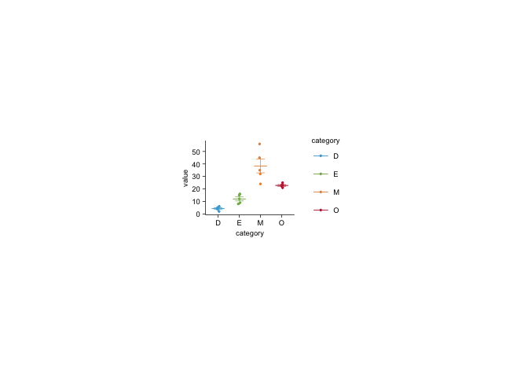

<!-- README.md is generated from README.Rmd. Please edit that file -->

# tidyplots

<!-- badges: start -->

[](https://www.tidyverse.org/lifecycle/#experimental)
<!-- badges: end -->

The goal of `tidyplots` is make to it ridiculously simple to create
ready-to-use scientific plots by gradually adding and adjusting plot
components. It follows a similar logic as `ggplot2`, but uses the pipe
`%>%` instead of `+`, which allows for more flexible and powerful
workflows. Moreover, `tidyplots` is making the most common scientific
plotting routines more accessible, by proving a clean and minimalist
interface. Finally, it is fully compatible with ggplot code.

## Installation

You can install the development version of `tidyplots` from
[GitHub](https://github.com/) with:

``` r
# install.packages("devtools")
devtools::install_github("jbengler/tidyplots")
```

## Example

This is a basic example which shows you how to solve a common problem:

``` r
library(tidyplots)

df_demo %>% 
  tidy_plot(x = category, y = value, color = category, fill = category) %>% 
  add_bar(alpha = 0.3) %>% 
  add_error() %>% 
  add_jitter()
```



## Learn more

<https://jbengler.github.io/tidyplots/>
