<!-- README.md is generated from README.Rmd. Please edit that file -->

# tidyplots <a href="https://jbengler.github.io/tidyplots/">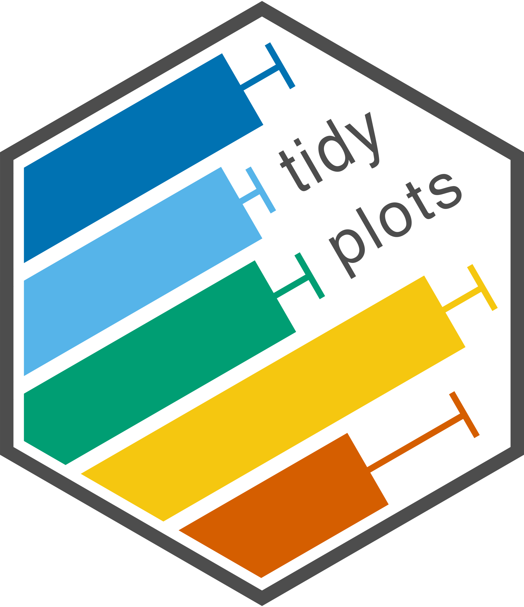</a>

<!-- badges: start -->

[](https://github.com/jbengler/tidyplots/actions/workflows/R-CMD-check.yaml)
[](https://CRAN.R-project.org/package=tidyplots)
<!-- badges: end -->

The goal of `tidyplots` is to streamline the creation of
publication-ready plots for scientific papers. It allows to gradually
add, remove and adjust plot components using a consistent and intuitive
syntax.

## Installation

You can install the released version of tidyplots from
[CRAN](https://cran.r-project.org/) with:

``` r
install.packages("tidyplots")
```

And the development version from [GitHub](https://github.com/) with:

``` r
# install.packages("devtools")
devtools::install_github("jbengler/tidyplots")
```

## Usage

Here are some examples. Also have a look at the [getting started
guide](https://jbengler.github.io/tidyplots/articles/tidyplots.html) and
the [full
documentation](https://jbengler.github.io/tidyplots/reference/).

``` r
library(tidyplots)

study %>% 
  tidyplot(x = treatment, y = score, color = treatment) %>% 
  add_mean_bar(alpha = 0.4) %>% 
  add_sem_errorbar() %>% 
  add_data_points_beeswarm()
```

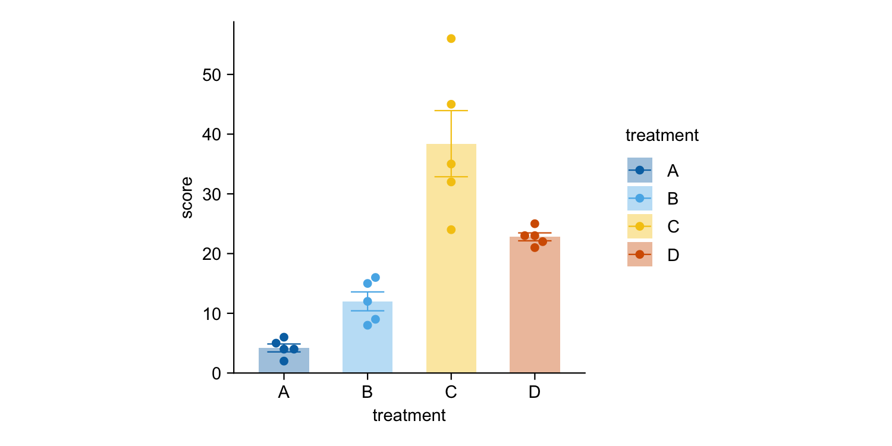

``` r
energy %>% 
  tidyplot(x = year, y = power, color = energy_source) %>% 
  add_barstack_absolute()
```

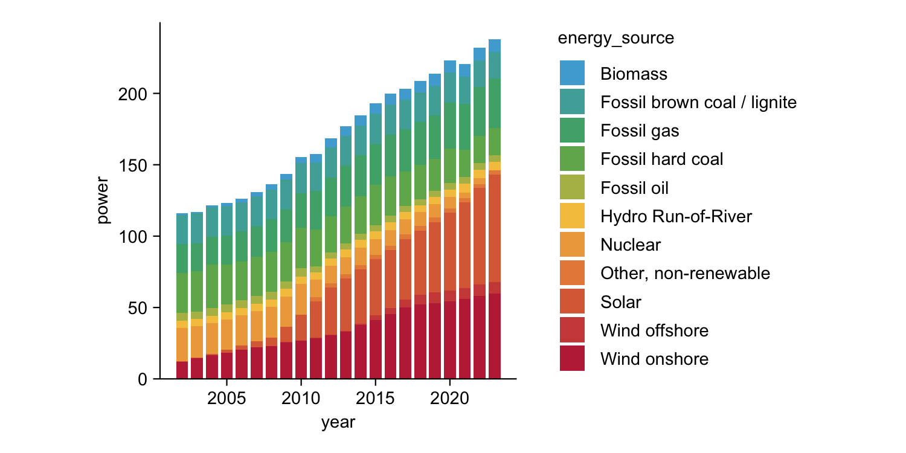

``` r
energy %>% 
  dplyr::filter(year %in% c(2005, 2010, 2015, 2020)) %>% 
  tidyplot(y = power, color = energy_source) %>% 
  add_donut() %>% 
  split_plot(by = year)
```

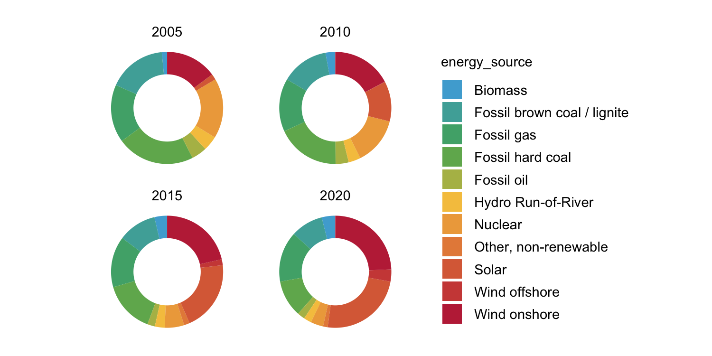

``` r
energy_week %>% 
  tidyplot(x = date, y = power, color = energy_source) %>% 
  add_areastack_absolute()
```

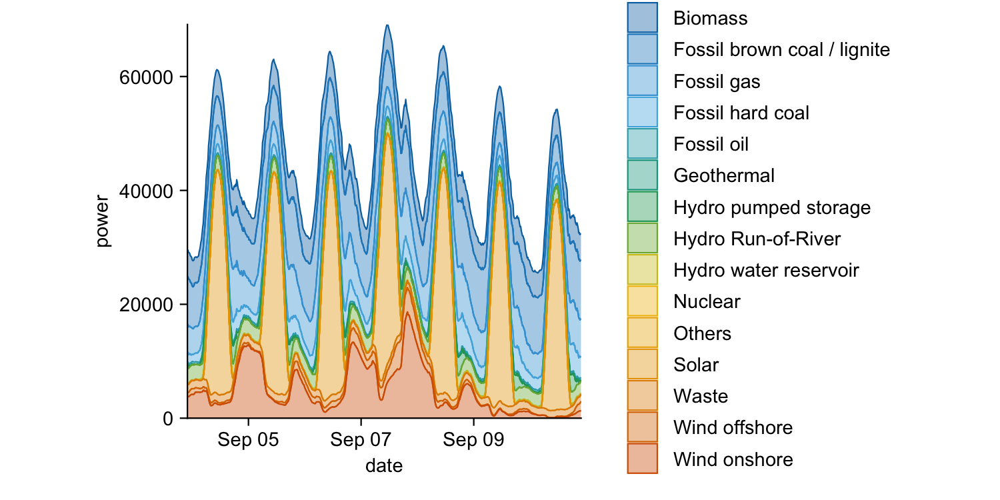

``` r
energy_week %>% 
  tidyplot(x = date, y = power, color = energy_source) %>% 
  add_areastack_relative()
```

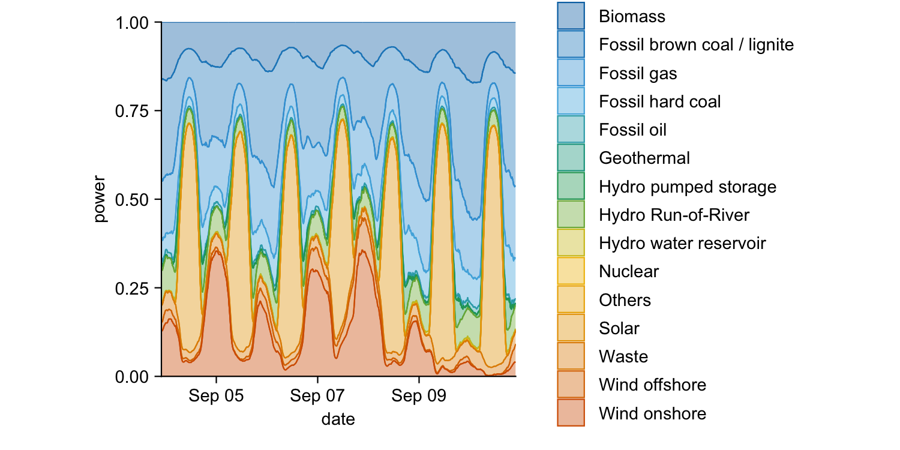

``` r
study %>% 
  tidyplot(x = group, y = score, color = dose) %>% 
  add_mean_bar(alpha = 0.4) %>% 
  add_mean_dash() %>% 
  add_mean_value()
```

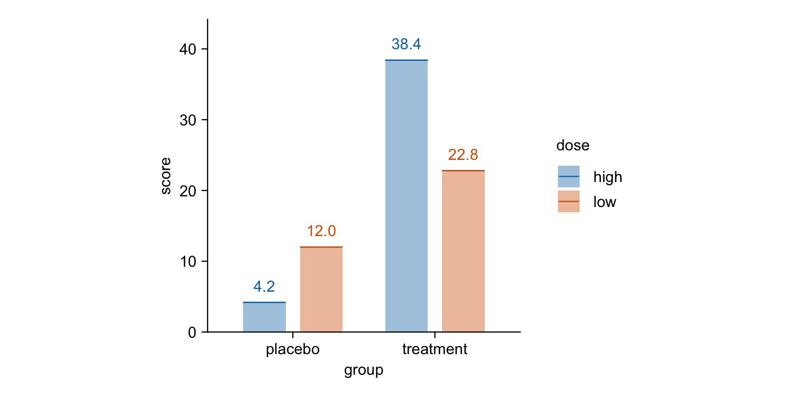

``` r
time_course %>%
  tidyplot(x = day, y = score, color = treatment) %>%
  add_mean_line() %>%
  add_mean_dot() %>%
  add_sem_ribbon()
```

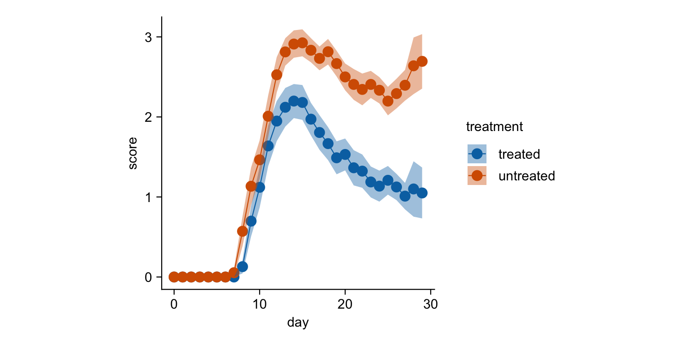

``` r
climate %>%
  tidyplot(x = month, y = year, color = max_temperature) %>%
  add_heatmap()
```

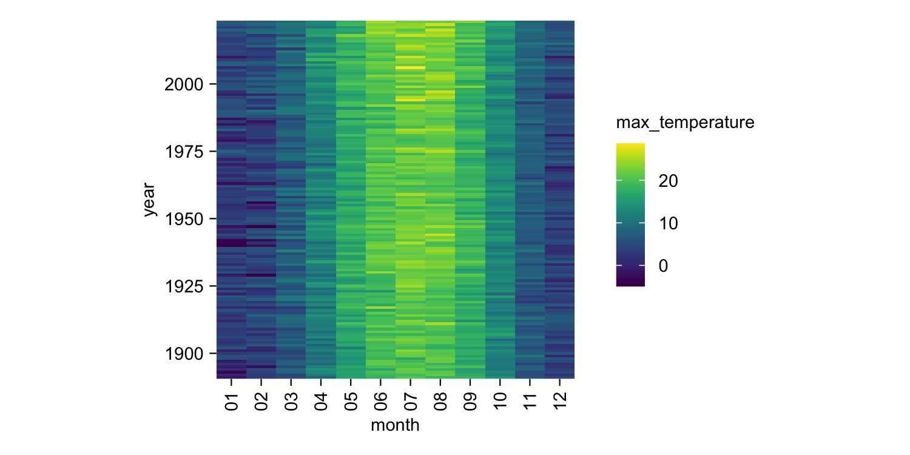

``` r
study %>% 
  tidyplot(x = treatment, y = score, color = treatment) %>% 
  add_boxplot() %>% 
  add_test_pvalue(ref.group = 1)
```

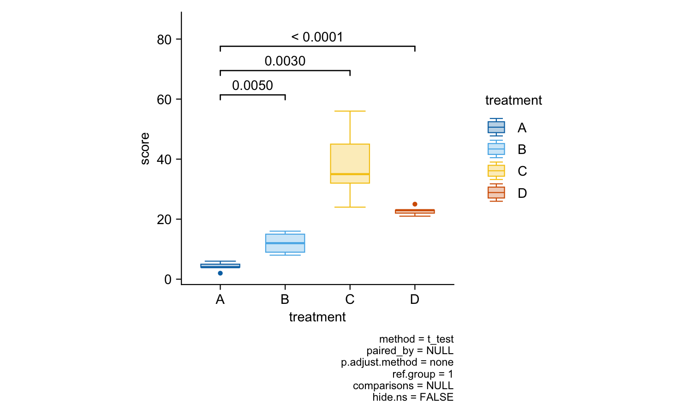

``` r
gene_expression %>% 
  dplyr::filter(external_gene_name %in% c("Apol6", "Col5a3", "Vgf", "Bsn")) %>% 
  tidyplot(x = condition, y = expression, color = sample_type) %>% 
  add_mean_dash() %>% 
  add_sem_errorbar() %>% 
  add_data_points_beeswarm() %>% 
  add_test_asterisks(hide_info = TRUE) %>% 
  remove_x_axis_title() %>% 
  split_plot(by = external_gene_name)
```

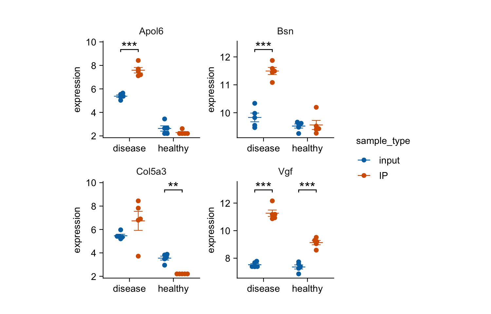

``` r
study %>% 
  tidyplot(x = treatment, y = score, color = treatment) %>% 
  add_mean_bar(alpha = 0.4) %>% 
  add_sem_errorbar() %>% 
  add_data_points_beeswarm() %>% 
  view_plot(title = "Default color scheme: 'friendly'") %>% 
  adjust_colors(colors_discrete_apple) %>% 
  view_plot(title = "Alternative color scheme: 'apple'")
```

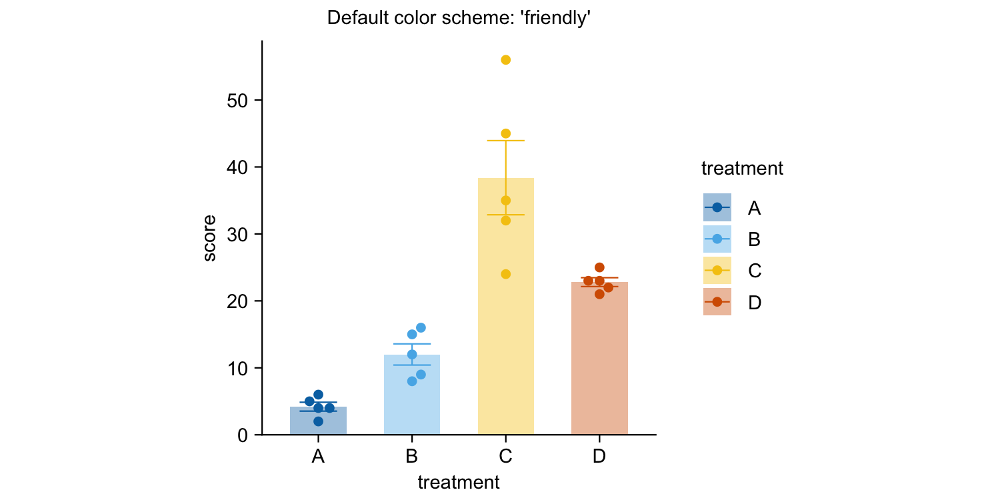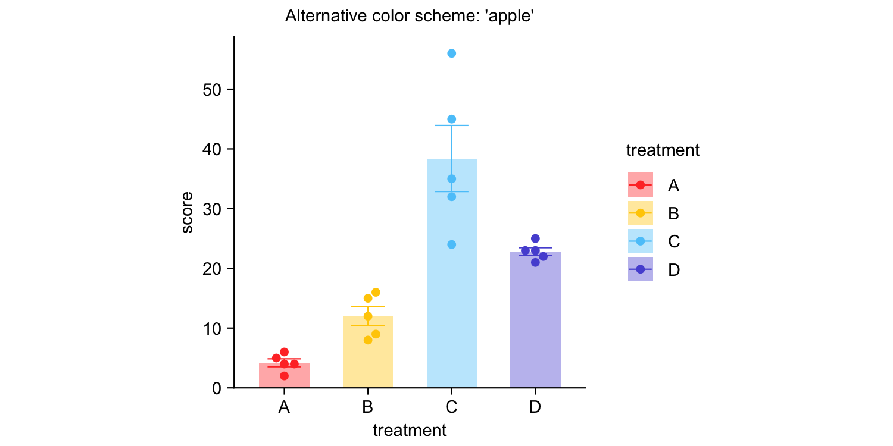

## Documentation

- [Package index](https://jbengler.github.io/tidyplots/reference/)  
  Overview of all tidyplots functions

- [Get
  started](https://jbengler.github.io/tidyplots/articles/tidyplots.html)  
  Getting started guide

- [Visualizing
  data](https://jbengler.github.io/tidyplots/articles/Visualizing-data.html)  
  Article with examples for common data visualizations

- [Advanced
  plotting](https://jbengler.github.io/tidyplots/articles/Advanced-plotting.html)  
  Article about advanced plotting techniques and workflows

- [Color
  schemes](https://jbengler.github.io/tidyplots/articles/Color-schemes.html)  
  Article about the use of color schemes

## Acknowledgements

I would like to thank Lars Binkle-Ladisch for our insightful discussions
and for consistently challenging my decisions regarding the naming of
functions and their arguments.

Many thanks to the R and tidyverse communities. tidyplots is built upon
their software and coding paradigms, and it would not have been possible
without their contributions.

tidyplots relies on several fantastic packages that handle all the heavy
lifting behind the scenes. These include cli, dplyr, forcats,
ggbeeswarm, ggplot2, ggpubr, ggrastr, ggrepel, glue, Hmisc, htmltools,
lifecycle, patchwork, purrr, rlang, scales, stringr, tidyr, and
tidyselect.
