# Color schemes

In this article, we will demonstrate the use of color schemes in
tidyplots. We will explore the default color schemes that come with
tidyplots and are ready to use for plotting. These include schemes for
discrete, continuous and diverging variables. To conclude, we will
discuss the creation of custom color schemes from hex values.

## Default color schemes

tidyplots comes with a number of default color schemes. Many of them are
adapted from the `viridisLite` and `RColorBrewer` packages. You access
them by loading the the tidyplots library and start typing `colors_`.
The auto-completion will guide you through a selection of `discrete`,
`continuous` and `diverging` schemes.

Let’s have a look at the signature scheme of tidyplots
`colors_discrete_friendly`, which was designed to work well for people
with color vision deficiency. When running the line
`colors_discrete_friendly` in the console or within a script, a preview
of the scheme will be rendered to the Viewer pane in the lower right of
the RStudio Desktop interface.

In essence, tidyplots color schemes are just a character vector of hex
colors with a special print method that sends a preview to the RStudio
viewer pane.

``` r
library(tidyplots)
colors_discrete_friendly
```

##### colors_discrete_friendly

A tidyplots color scheme with 6 colors.  
  
c(  
"#0072B2","#56B4E9","#009E73","#F5C710","#E69F00","#D55E00")

*Tip: You can copy individual hex colors directly from the preview to
use them in your script.*

### Discrete

Discrete color schemes are meant for categorical variables. The default
schemes in tidyplots consist of 5–7 colors. However, if more categories
are present in the plot, tidyplots will automatically fill up the gaps
between colors to deliver exactly the number that is required for the
plot.

Similarly, when more colors are provided than needed, tidyplots will
select the required number of colors by attempting to evenly sample from
the supplied color vector.

``` r
energy |> 
  tidyplot(year, energy, color = energy_source) |> 
  add_barstack_absolute()
```

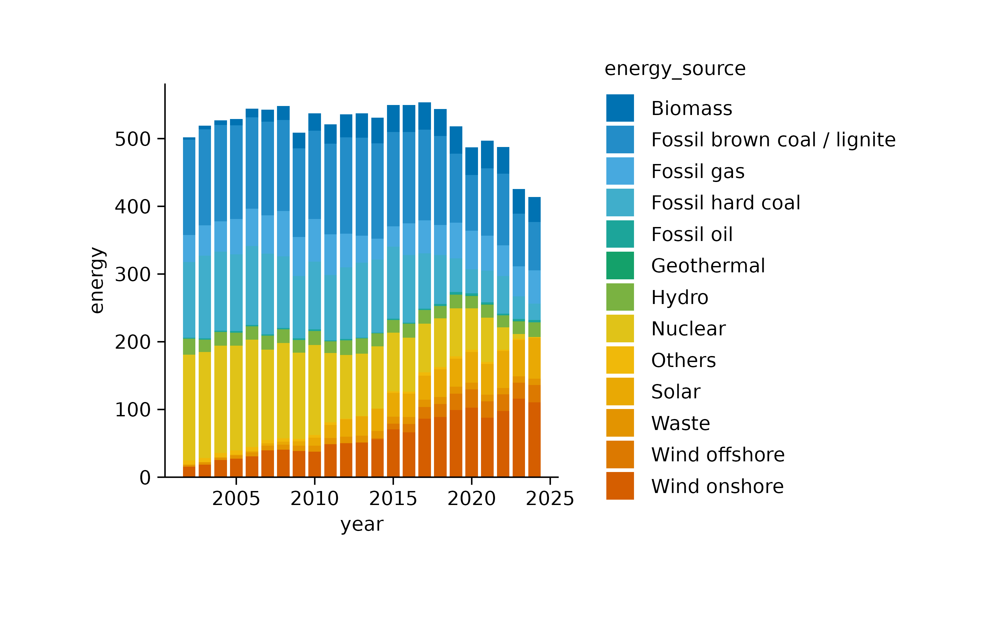

And here are some alternative color schemes.

``` r
energy |> 
  tidyplot(year, energy, color = energy_source) |> 
  add_barstack_absolute() |> 
  adjust_colors(colors_discrete_seaside)
```

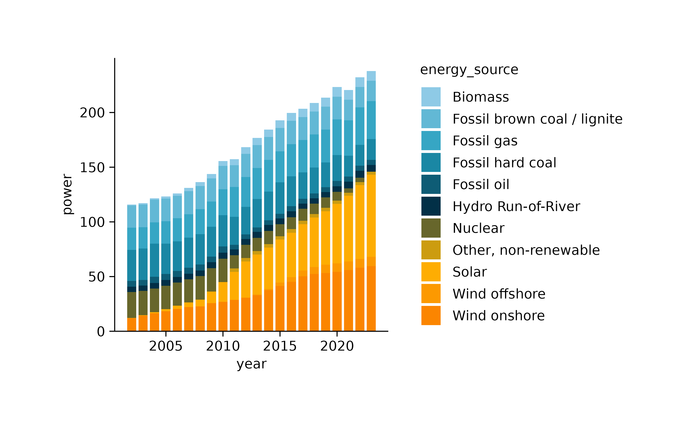

``` r
energy |> 
  tidyplot(year, energy, color = energy_source) |> 
  add_barstack_absolute() |> 
  adjust_colors(colors_discrete_friendly_long)
```

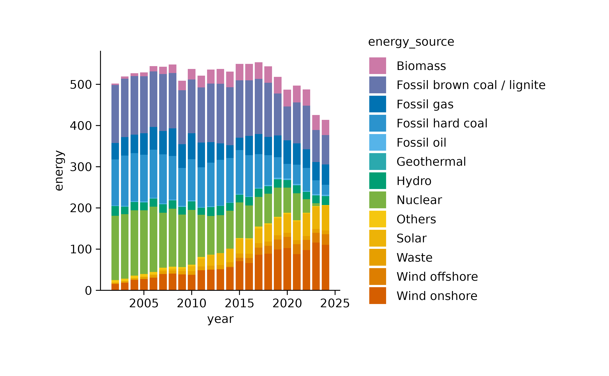

``` r
energy |> 
  tidyplot(year, energy, color = energy_source) |> 
  add_barstack_absolute() |> 
  adjust_colors(colors_discrete_apple)
```

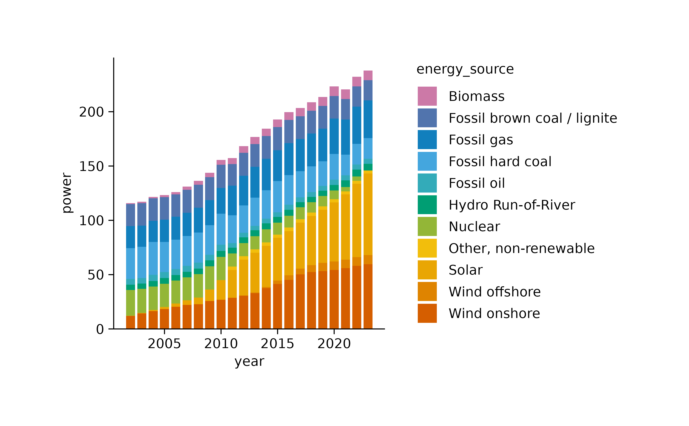

``` r
energy |> 
  tidyplot(year, energy, color = energy_source) |> 
  add_barstack_absolute() |> 
  adjust_colors(colors_discrete_ibm)
```

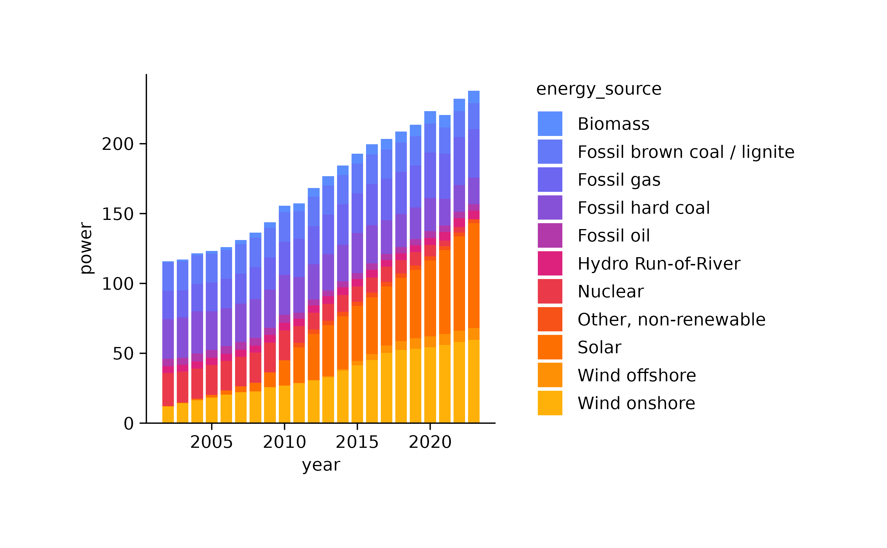

``` r
energy |> 
  tidyplot(year, energy, color = energy_source) |> 
  add_barstack_absolute() |> 
  adjust_colors(colors_discrete_candy)
```

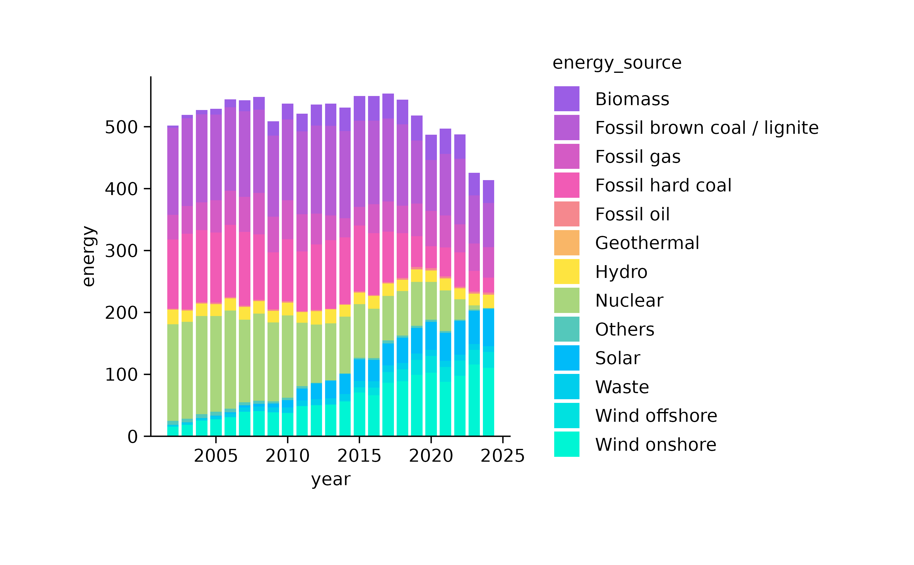

``` r
energy |> 
  tidyplot(year, energy, color = energy_source) |> 
  add_barstack_absolute() |> 
  adjust_colors(colors_discrete_alger)
```

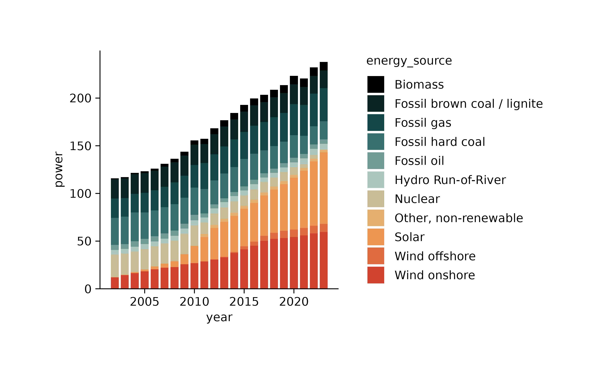

``` r
energy |> 
  tidyplot(year, energy, color = energy_source) |> 
  add_barstack_absolute() |> 
  adjust_colors(colors_discrete_rainbow)
```

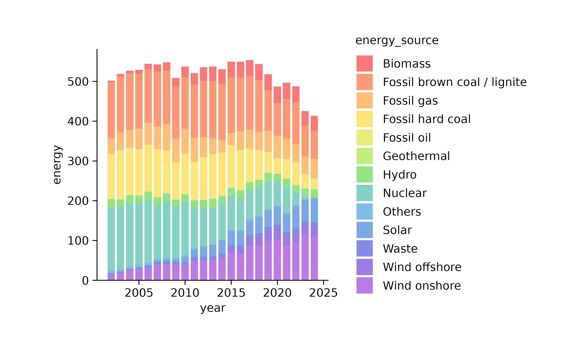

### Continuous

Continuous color schemes are meant for continuous variables. The default
schemes in tidyplots usually consist of 265 colors.

``` r
colors_continuous_viridis
```

##### colors_continuous_viridis

A tidyplots color scheme with 265 colors, downsampled to 42 colors.  
  
c(  
"#440154FF","#460A5DFF","#471264FF","#481B6DFF","#482374FF","#472C7AFF","#46337FFF","#443A83FF","#424186FF","#3F4889FF","#3C508BFF","#39568CFF","#365D8DFF","#33638DFF","#306A8EFF","#2D708EFF","#2B758EFF","#297B8EFF","#26818EFF","#24878EFF","#228D8DFF","#20928CFF","#1F988BFF","#1F9F88FF","#20A486FF","#24AA83FF","#29AF7FFF","#31B57BFF","#3BBB75FF","#45C06FFF","#53C569FF","#5EC962FF","#6ECE58FF","#7BD250FF","#8AD647FF","#9CD93CFF","#AADC32FF","#BDDF26FF","#CCE11EFF","#DEE318FF","#EDE51BFF","#FDE725FF")

Here is a use case for a continuous color scheme.

``` r
climate |> 
  tidyplot(x = month, y = year, color = max_temperature) |> 
  add_heatmap()
```


And here are some alternative color schemes.

``` r
climate |> 
  tidyplot(x = month, y = year, color = max_temperature) |> 
  add_heatmap() |> 
  adjust_colors(new_colors = colors_continuous_inferno)
```

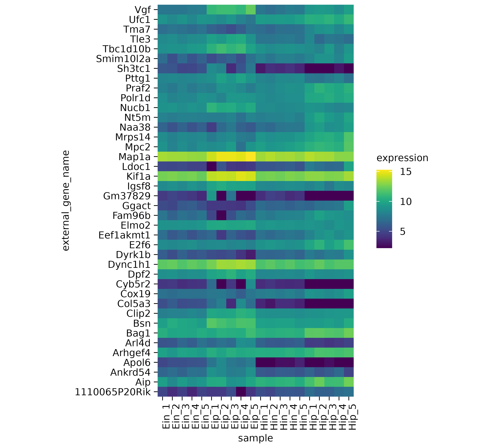

``` r
climate |> 
  tidyplot(x = month, y = year, color = max_temperature) |> 
  add_heatmap() |> 
  adjust_colors(new_colors = colors_continuous_mako)
```

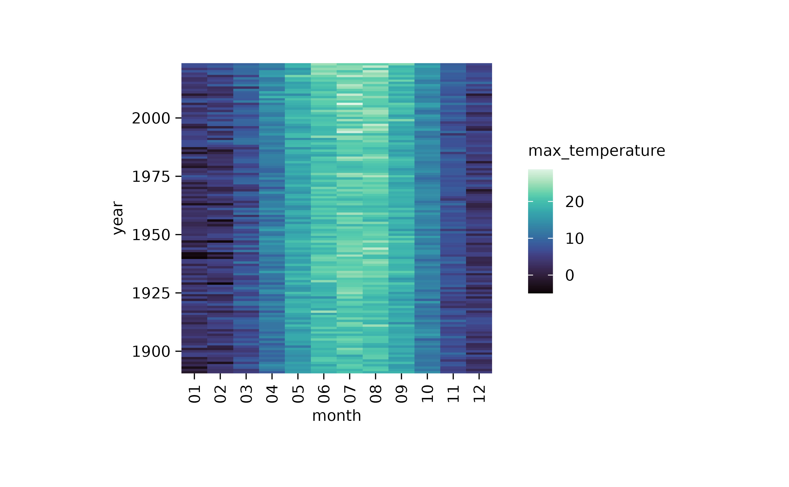

``` r
climate |> 
  tidyplot(x = month, y = year, color = max_temperature) |> 
  add_heatmap() |> 
  adjust_colors(new_colors = colors_continuous_turbo)
```

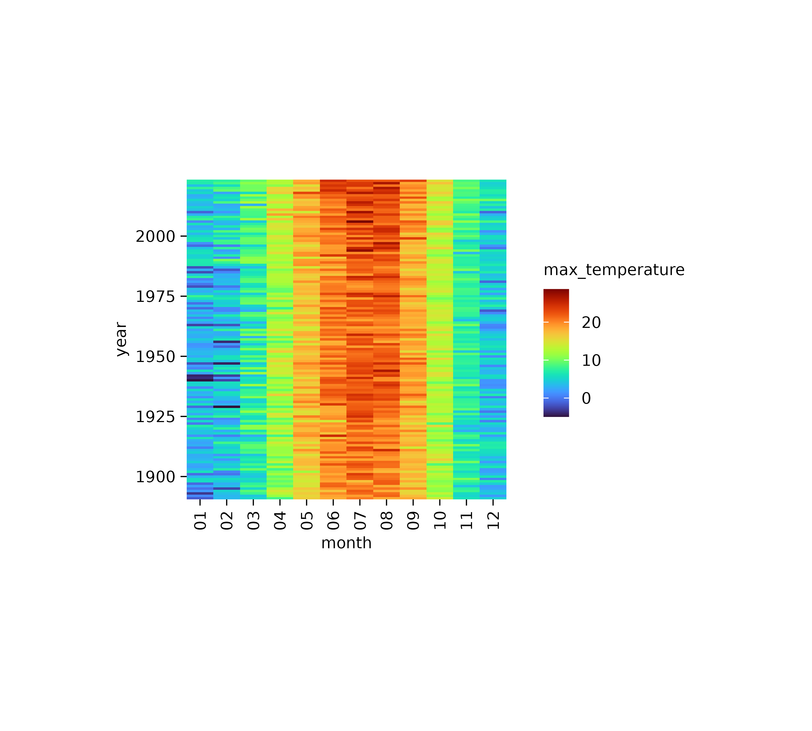

``` r
climate |> 
  tidyplot(x = month, y = year, color = max_temperature) |> 
  add_heatmap() |> 
  adjust_colors(new_colors = colors_continuous_rocket)
```

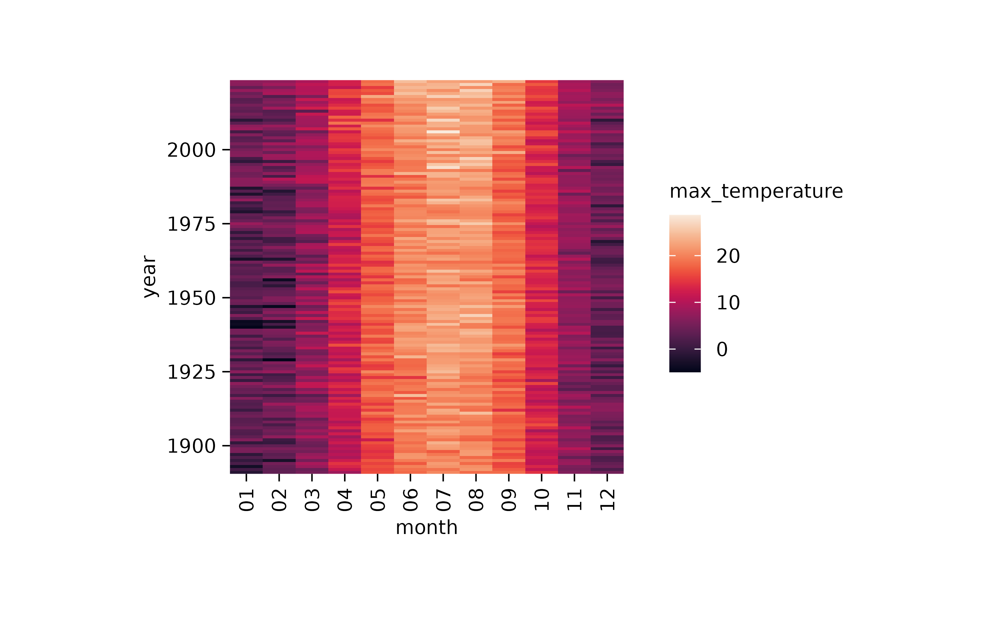

### Diverging

Diverging color schemes are meant for continuous variables that have a
central point in the middle. A classical example is the blue–white–red
gradient used for gene expression heatmaps.

``` r
colors_diverging_blue2red
```

##### colors_diverging_blue2red

A tidyplots color scheme with 17 colors.  
  
c(  
"#0000FF","#1F1FFF","#3F3FFF","#5F5FFF","#7F7FFF","#9F9FFF","#BFBFFF","#DFDFFF","#FFFFFF","#FFDFDF","#FFBFBF","#FF9F9F","#FF7F7F","#FF5F5F","#FF3F3F","#FF1F1F","#FF0000")

Here is a use case for a diverging color scheme.

``` r
gene_expression |> 
  tidyplot(x = sample, y = external_gene_name, color = expression) |> 
  add_heatmap(scale = "row") |>
  sort_y_axis_labels(direction) |> 
  adjust_size(height = 100)
```

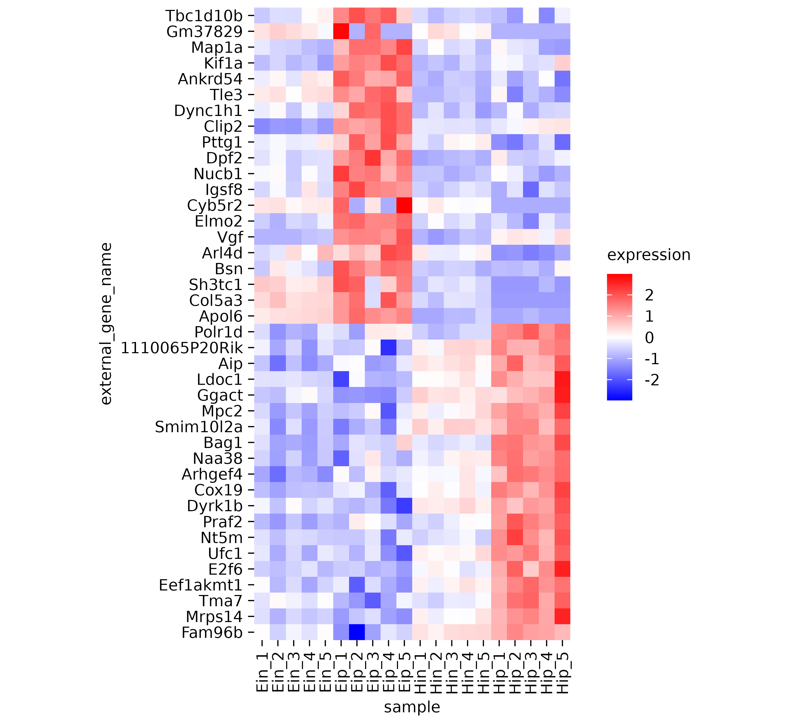

And here are some alternative color schemes.

``` r
gene_expression |> 
  tidyplot(x = sample, y = external_gene_name, color = expression) |> 
  add_heatmap(scale = "row") |>
  sort_y_axis_labels(direction) |> 
  adjust_size(height = 100) |> 
  adjust_colors(new_colors = colors_diverging_blue2brown)
```

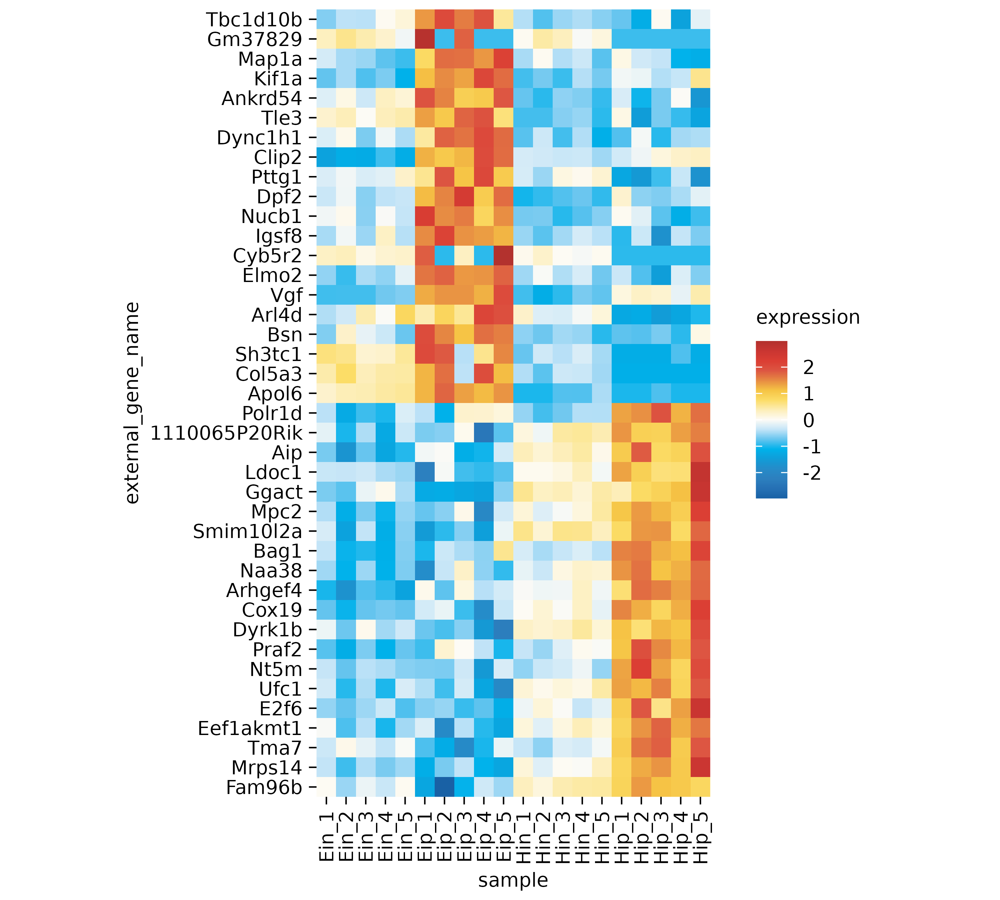

``` r
gene_expression |> 
  tidyplot(x = sample, y = external_gene_name, color = expression) |> 
  add_heatmap(scale = "row") |>
  sort_y_axis_labels(direction) |> 
  adjust_size(height = 100) |> 
  adjust_colors(new_colors = colors_diverging_spectral)
```

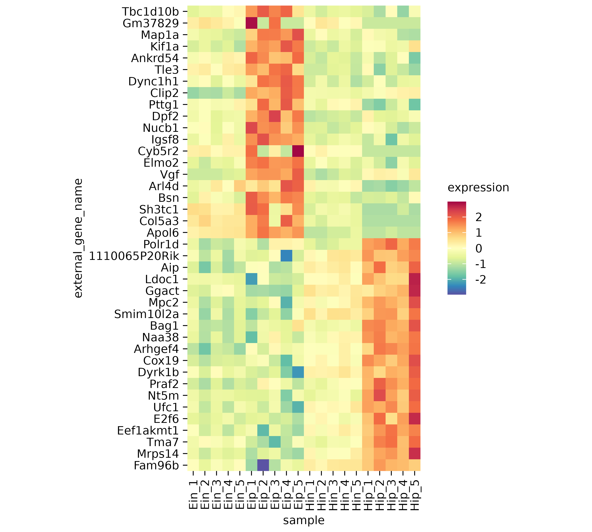

``` r
gene_expression |> 
  tidyplot(x = sample, y = external_gene_name, color = expression) |> 
  add_heatmap(scale = "row") |>
  sort_y_axis_labels(direction) |> 
  adjust_size(height = 100) |> 
  adjust_colors(new_colors = colors_diverging_icefire)
```

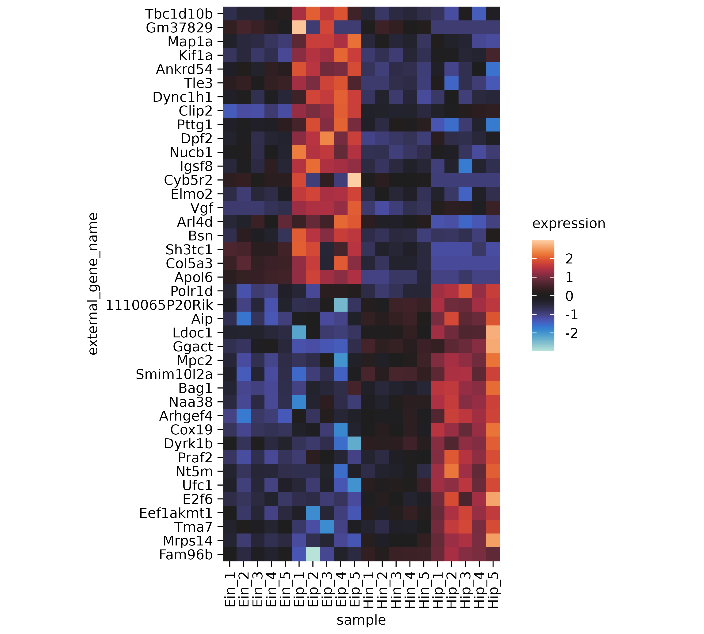

## Custom color schemes

Of course you can also construct custom color schemes using the
[`new_color_scheme()`](https://jbengler.github.io/tidyplots/reference/new_color_scheme.md)
function.

``` r
my_colors <- 
  new_color_scheme(c("#ECA669","#E06681","#8087E2","#E2D269"),
                   name = "my_custom_color_scheme")
my_colors
```

##### my_custom_color_scheme

A tidyplots color scheme with 4 colors.  
  
c(  
"#ECA669","#E06681","#8087E2","#E2D269")

Than you can use your scheme as input to the
[`adjust_colors()`](https://jbengler.github.io/tidyplots/reference/adjust_colors.md)
function.

``` r
energy |> 
  tidyplot(year, energy, color = energy_source) |> 
  add_barstack_absolute() |> 
  adjust_colors(new_colors = my_colors)
```

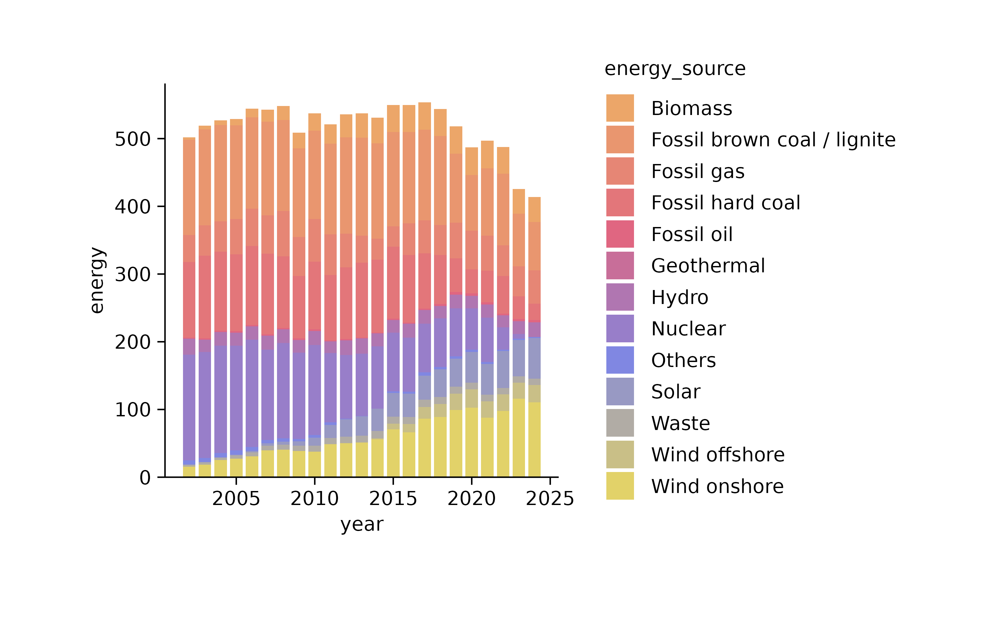

Besides creating new schemes, you can also subset and concatenate
existing schemes in the exact same way you would do with a regular
character string.

``` r
colors_discrete_metro[2]
```

##### Untitled color scheme

A tidyplots color scheme with 1 colors.  
  
c(  
"#4FAE62")

``` r
colors_discrete_metro[2:4]
```

##### Untitled color scheme

A tidyplots color scheme with 3 colors.  
  
c(  
"#4FAE62","#F6C54D","#E37D46")

``` r
c(colors_discrete_metro, colors_discrete_seaside)
```

##### Untitled color scheme

A tidyplots color scheme with 10 colors.  
  
c(  
"#4DACD6","#4FAE62","#F6C54D","#E37D46","#C02D45","#8ecae6","#219ebc","#023047","#ffb703","#fb8500")

## What’s more?

To dive deeper into code-based plotting, here a couple of resources.

### tidyplots documentation

- [Package
  index](https://jbengler.github.io/tidyplots/reference/index.html)  
  Overview of all tidyplots functions

- [Get
  started](https://jbengler.github.io/tidyplots/articles/tidyplots.html)  
  Getting started guide

- [Visualizing
  data](https://jbengler.github.io/tidyplots/articles/Visualizing-data.html)  
  Article with examples for common data visualizations

- [Advanced
  plotting](https://jbengler.github.io/tidyplots/articles/Advanced-plotting.html)  
  Article about advanced plotting techniques and workflows

- [Color
  schemes](https://jbengler.github.io/tidyplots/articles/Color-schemes.html)  
  Article about the use of color schemes

### Other resources

- [Hands-On Programming with
  R](https://rstudio-education.github.io/hopr/)  
  Free online book by Garrett Grolemund

- [R for Data Science](https://r4ds.hadley.nz)  
  Free online book by Hadley Wickham

- [Fundamentals of Data
  Visualization](https://clauswilke.com/dataviz/)  
  Free online book by Claus O. Wilke
