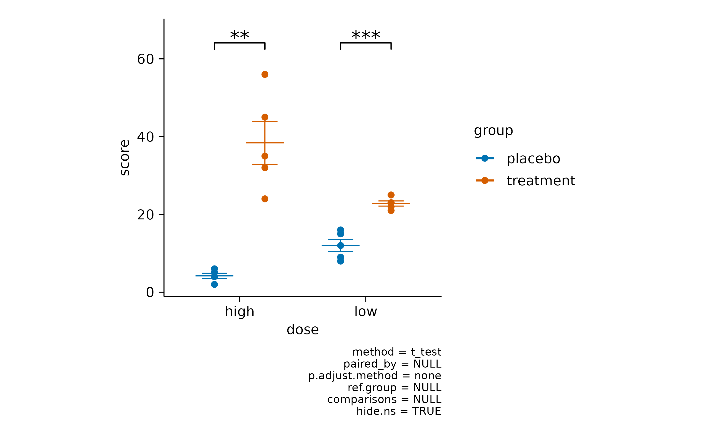
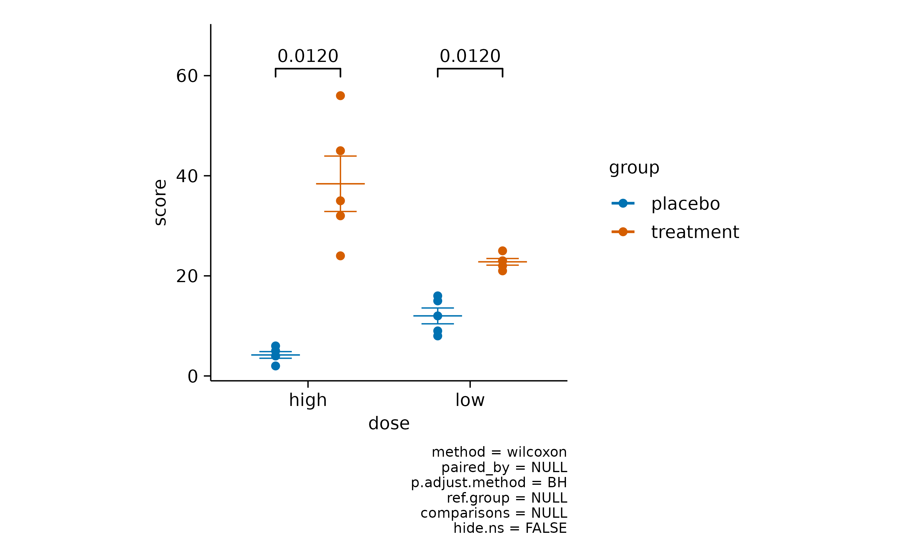
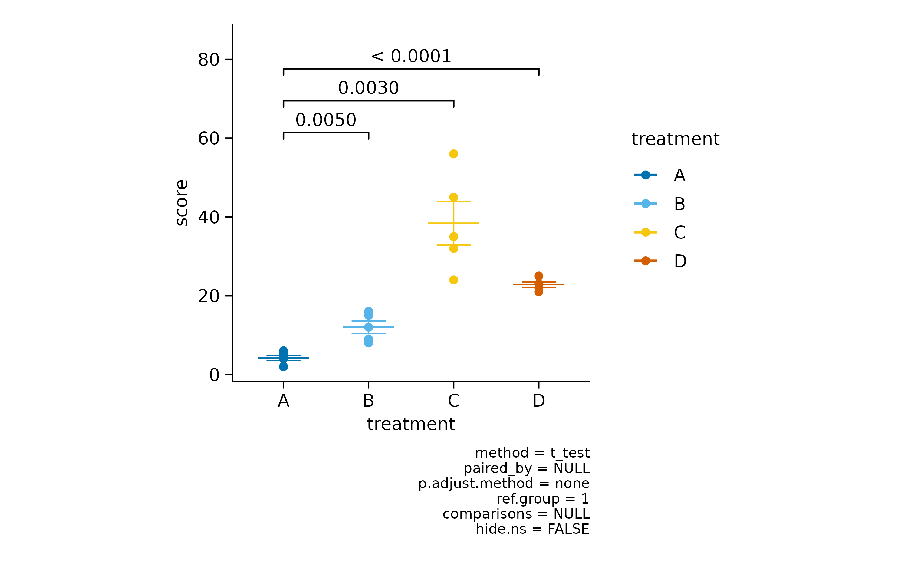
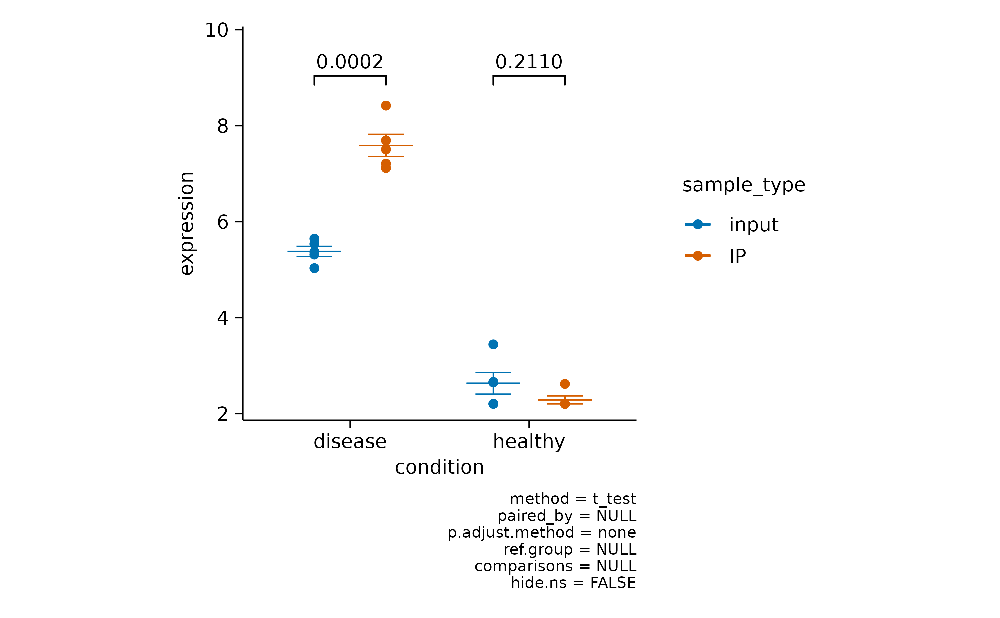
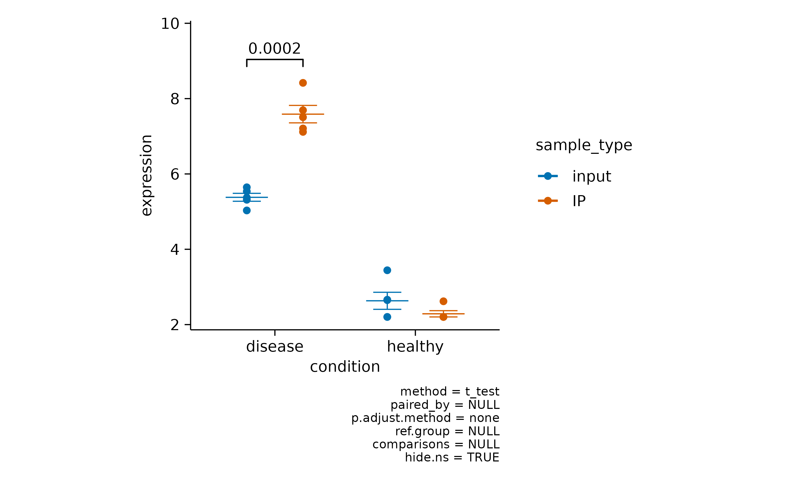
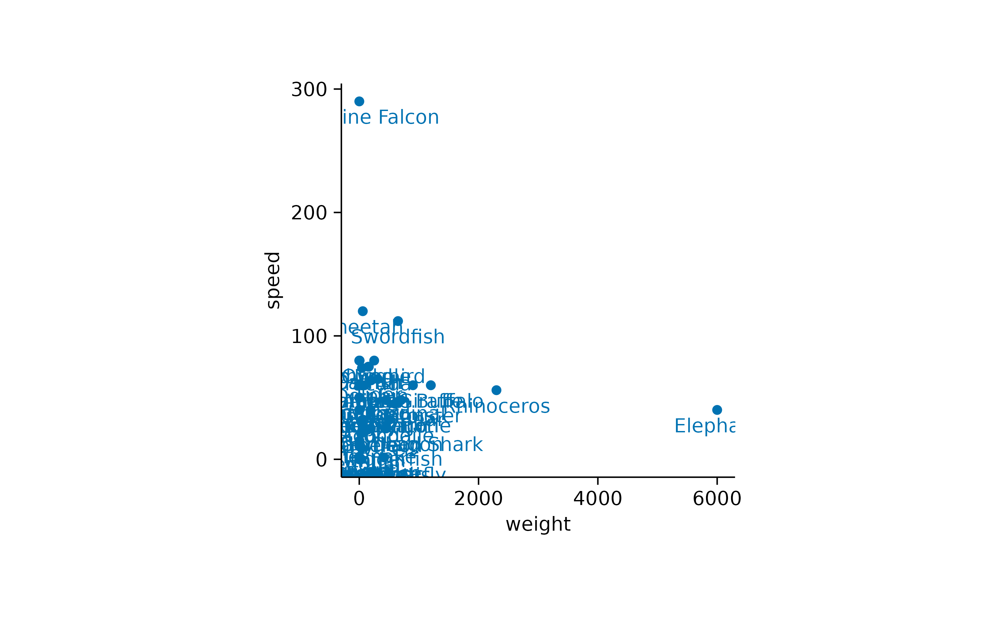

# Visualizing data

In this article, we will explore the visualization of different types of
datasets using tidyplots. We will cover the plotting of raw data points,
amounts, and heatmaps, as well as measures for central tendency,
dispersion, and uncertainty. We will conclude by visualizing
distributions and proportions, and adding statistical comparisons and
annotations.

## Data points

Plotting the raw data points is probably the most bare bone way to
visualize a dataset. The corresponding function in tidyplots is called
[`add_data_points()`](https://jbengler.github.io/tidyplots/reference/add_data_points.md).

``` r
library(tidyplots)

animals |> 
  tidyplot(x = weight, y = size) |> 
  add_data_points()
```


In the above example some data points appear to overlap other points. To
account for this so called *overplotting*, you might want to add a thin
white border around the points. This is achieved by setting the argument
`white_border = TRUE`.

``` r
animals |> 
  tidyplot(x = weight, y = size) |> 
  add_data_points(white_border = TRUE)
```


Another way is to make the points transparent using the `alpha`
argument.

``` r
animals |> 
  tidyplot(x = weight, y = size) |> 
  add_data_points(alpha = 0.4)
```


Or to change the plotting symbol to an open `shape`.

``` r
animals |> 
  tidyplot(x = weight, y = size) |> 
  add_data_points(shape = 1)
```


However, data points can also be used to plot a *discrete variable*
against a *continuous variable*.

``` r
study |> 
  tidyplot(x = treatment, y = score) |> 
  add_data_points()
```


To avoid overplotting in this scenario, there are two additional
options. You can add some random noise to the y position, also known as
*jitter*.

``` r
study |> 
  tidyplot(x = treatment, y = score) |> 
  add_data_points_jitter()
```


Alternatively, you can use an algorithm that keeps the points centered
and just moves potentially overlapping points to the sides.

``` r
study |> 
  tidyplot(x = treatment, y = score) |> 
  add_data_points_beeswarm()
```


## Amounts

For some datasets, it makes sense to `count` or `sum` up data points in
order to arrive to conclusions. As one example, let’s have a look at the
`spendings` dataset.

``` r
spendings
#> # A tibble: 19 × 4
#>    date       title            amount category      
#>    <date>     <chr>             <dbl> <chr>         
#>  1 2023-10-01 Groceries           100 Food          
#>  2 2023-10-01 Gasoline             40 Transportation
#>  3 2023-10-01 Rent               1200 Housing       
#>  4 2023-10-02 Electricity          80 Utilities     
#>  5 2023-10-03 School Supplies      75 Education     
#>  6 2023-10-03 Health Insurance    200 Insurance     
#>  7 2023-10-04 Dining Out           60 Food          
#>  8 2023-10-04 Cell Phone Bill      50 Utilities     
#>  9 2023-10-05 Groceries            90 Food          
#> 10 2023-10-06 Gasoline             40 Transportation
#> 11 2023-10-07 Medical Checkup     150 Health        
#> 12 2023-10-07 Dining Out           70 Food          
#> 13 2023-10-08 Groceries           110 Food          
#> 14 2023-10-08 Internet Bill        60 Utilities     
#> 15 2023-10-09 Entertainment        30 Entertainment 
#> 16 2023-10-10 Groceries            50 Food          
#> 17 2023-10-12 Public Transport     70 Transportation
#> 18 2023-10-13 Dentist              90 Health        
#> 19 2023-10-15 Car Insurance        40 Insurance
```

As you can see, this dataset contains family spendings over a time
period of 15 days in October. Here, it might be informative to see which
spending categories are reoccurring and which are just one time
spendings.

``` r
spendings |> 
  tidyplot(x = category) |> 
  add_count_bar()
```


One thing to note here is that the x-axis labels are overlapping and are
thus unreadable. There are at least two possible solutions for this. One
is to swap the x and y-axis.

``` r
spendings |> 
  tidyplot(y = category) |> 
  add_count_bar()
```


The other one is to rotate the x-axis labels.

``` r
spendings |> 
  tidyplot(x = category) |> 
  add_count_bar() |> 
  adjust_x_axis(rotate_labels = TRUE)
```


Now we can appreciate that this family had reoccurring spendings for
*Food* but just one spending for *Housing*.

Next, we ask the question *how much* was spend on each of the categories
by plotting the `sum` amount.

``` r
spendings |> 
  tidyplot(x = category, y = amount, color = category) |> 
  add_sum_bar() |> 
  adjust_x_axis(rotate_labels = TRUE)
```


Note that we had to introduce the argument `y = amount` in the
[`tidyplot()`](https://jbengler.github.io/tidyplots/reference/tidyplot.md)
function to make it clear which variable should be summed up.

I also added `color = category` in the
[`tidyplot()`](https://jbengler.github.io/tidyplots/reference/tidyplot.md)
function to have the variable `category` encoded by different colors.

Since the labels for the variable `category` are now duplicated in the
plot, one could argue that it would be justified to remove the
duplicated information on the x-axis.

``` r
spendings |> 
  tidyplot(x = category, y = amount, color = category) |> 
  add_sum_bar() |> 
  adjust_x_axis(rotate_labels = TRUE) |> 
  remove_x_axis_labels() |> 
  remove_x_axis_title() |> 
  remove_x_axis_ticks()
```


Note that besides the x-axis labels, I also removed the x-axis ticks and
x-axis title to achieve a cleaner look.

Of course you are free to play around with different graphical
representations of the sum values. Here is an example of a lollipop plot
constructed from a thin `bar` and a `dot`.

``` r
spendings |> 
  tidyplot(x = category, y = amount, color = category) |> 
  add_sum_bar(width = 0.03) |> 
  add_sum_dot() |> 
  add_sum_value(accuracy = 1) |> 
  adjust_x_axis(rotate_labels = TRUE) |> 
  remove_x_axis_labels() |> 
  remove_x_axis_title() |> 
  remove_x_axis_ticks()
```


I also added the sum value as text label using the
[`add_sum_value()`](https://jbengler.github.io/tidyplots/reference/add_sum_bar.md)
function.

## Heatmaps

Heatmaps are a great way to plot a *continuous variable* across two
additional *variables*. To exemplify this, we will have a look at the
`gene_expression` dataset.

``` r
gene_expression |> 
  dplyr::glimpse()
#> Rows: 800
#> Columns: 11
#> $ ensembl_gene_id    <chr> "ENSMUSG00000033576", "ENSMUSG00000033576", "ENSMUS…
#> $ external_gene_name <chr> "Apol6", "Apol6", "Apol6", "Apol6", "Apol6", "Apol6…
#> $ sample             <chr> "Hin_1", "Hin_2", "Hin_3", "Hin_4", "Hin_5", "Ein_1…
#> $ expression         <dbl> 2.203755, 2.203755, 2.660558, 2.649534, 3.442740, 5…
#> $ group              <chr> "Hin", "Hin", "Hin", "Hin", "Hin", "Ein", "Ein", "E…
#> $ sample_type        <chr> "input", "input", "input", "input", "input", "input…
#> $ condition          <chr> "healthy", "healthy", "healthy", "healthy", "health…
#> $ is_immune_gene     <chr> "no", "no", "no", "no", "no", "no", "no", "no", "no…
#> $ direction          <chr> "up", "up", "up", "up", "up", "up", "up", "up", "up…
#> $ log2_foldchange    <dbl> 9.395505, 9.395505, 9.395505, 9.395505, 9.395505, 9…
#> $ padj               <dbl> 3.793735e-28, 3.793735e-28, 3.793735e-28, 3.793735e…
```

We will start by plotting the `expression` values of each
`external_gene_name` across the `sample` variable.

``` r
gene_expression |> 
  tidyplot(x = sample, y = external_gene_name, color = expression) |> 
  add_heatmap()
```


One thing to note here is that the y-axis labels are overlapping. So
let’s increase the height of the plot area from 50 to 100 mm.

``` r
gene_expression |> 
  tidyplot(x = sample, y = external_gene_name, color = expression) |> 
  add_heatmap() |>
  adjust_size(height = 100)
```


The next thing to note is that some of the rows like *Map1a* and *Kif1a*
show very high values while other rows show much lower values. Let’s
apply a classical technique to reserve the color range for differences
within each row. This is done by calculating *row z scores* for each row
individually. Luckily, tidyplots does this for us when setting the
argument `scale = "row"` within the
[`add_heatmap()`](https://jbengler.github.io/tidyplots/reference/add_heatmap.md)
function call.

``` r
gene_expression |> 
  tidyplot(x = sample, y = external_gene_name, color = expression) |> 
  add_heatmap(scale = "row") |>
  adjust_size(height = 100)
```


Now it much easier to appreciate the dynamics of individual genes across
the samples on the x-axis.

However, the rows appear to be mixed. Some having rather high expression
in the “Eip” samples while others have high value in the “Hip” samples.
Conveniently, there is a variable called `direction` in the dataset,
which classifies genes as being either “up” or “down” regulated. Let’s
use this variable to sort our y-axis.

``` r
gene_expression |> 
  tidyplot(x = sample, y = external_gene_name, color = expression) |> 
  add_heatmap(scale = "row") |>
  adjust_size(height = 100) |> 
  sort_y_axis_labels(direction)
```


## Central tendency

In cases with multiple data points per experimental group, the `mean`
and the `median` are a great way to compute a typical center value for
the group, also known as central tendency measure. In tidyplots, these
function start with `add_mean_` or `add_median_`.

``` r
study |> 
  tidyplot(x = treatment, y = score) |> 
  add_data_points_beeswarm() |> 
  add_mean_dash()
```


The second part of the function name is dedicated to the graphical
representation. These include the representation as `bar`, `dash`,
`dot`, `value`, `line` or `area`. Of course, these different
representations can also be combined. Like in this case `line` and
`dot`.

``` r
time_course |> 
  tidyplot(x = day, y = score, color = treatment) |> 
  add_mean_line() |> 
  add_mean_dot()
```


Or in this case `line` and `area`.

``` r
time_course |> 
  tidyplot(x = day, y = score, color = treatment) |> 
  add_mean_line(linewidth = 1) |> 
  add_mean_area(alpha = 0.2)
```


Here is one more example using `bar` and `value`.

``` r
study |> 
  tidyplot(x = treatment, y = score) |> 
  add_mean_bar() |> 
  add_mean_value()
```


You could also plot the `mean` and the `median` together to explore in
which cases they diverge. In the example below the `mean` is shown in
orange and the `median` in purple.

``` r
study |> 
  tidyplot(x = treatment, y = score) |> 
  add_data_points_beeswarm(color = "grey") |> 
  add_mean_dash(color = "orange") |> 
  add_median_dash(color = "purple")
```


## Dispersion & uncertainty

To complement the central tendency measure, it is often helpful to
provide information about the variability or dispersion of the data
points. Such measures include the standard error of the mean `sem`, the
standard deviation `sd`, the `range` from the highest to the lowest data
point and the 95% confidence interval `ci95`.

A classical representation of dispersion is an `errorbar`.

``` r
time_course |> 
  tidyplot(x = day, y = score, color = treatment) |> 
  add_mean_line() |> 
  add_mean_dot() |> 
  add_sem_errorbar(width = 2)
```


Or the use of a semitransparent `ribbon`.

``` r
time_course |> 
  tidyplot(x = day, y = score, color = treatment) |> 
  add_mean_line() |> 
  add_mean_dot() |> 
  add_sem_ribbon()
```


Another widely used alternative, especially for not normally distributed
data is the use of `violin` or `boxplot`. Starting with the `violin`,
the shape of these plots resembles the underlying distribution of the
data points.

``` r
study |> 
  tidyplot(x = treatment, y = score, color = treatment) |> 
  add_violin()
```


These can be further augmented by adding, for example, the 0.5 quantile
and the underlying data points.

``` r
study |> 
  tidyplot(x = treatment, y = score, color = treatment) |> 
  add_violin(draw_quantiles = 0.5) |> 
  add_data_points_beeswarm()
```


The `boxplot` is the more classical approach, in which the quantiles are
visualized by a box and whiskers.

``` r
study |> 
  tidyplot(x = treatment, y = score, color = treatment) |> 
  add_boxplot()
```


Finally, although it is not strictly a measure of central tendency, you
can fit a curve through your data to derive an abstracted
representation.

``` r
time_course |> 
  tidyplot(x = day, y = score, color = treatment) |> 
  add_curve_fit()
```


## Distribution

When looking at a single distribution of values, a classical approach
for visualization is a `histogram`.

``` r
energy |> 
  tidyplot(x = energy) |> 
  add_histogram()
```


If you want to compare multiple distributions, `violin` or `boxplot` are
two potential solutions.

``` r
distributions |> 
  tidyplot(x = name, y = value) |> 
  add_violin() |> 
  add_data_points_beeswarm()
```


## Proportion

Proportional data provides insights into the proportion or percentage
that each individual category contributes to the total. To explore the
visualization of proportional data in tidyplots, let’s introduce the
`energy` dataset.

``` r
energy |> 
  dplyr::glimpse()
#> Rows: 344
#> Columns: 5
#> $ year          <dbl> 2002, 2002, 2002, 2002, 2002, 2002, 2002, 2002, 2002, 20…
#> $ energy_source <fct> Biomass, Fossil brown coal / lignite, Fossil gas, Fossil…
#> $ energy_type   <fct> Renewable, Fossil, Fossil, Fossil, Fossil, Renewable, Re…
#> $ energy        <dbl> 3.723, 140.544, 39.983, 111.427, 1.755, 0.000, 23.377, 1…
#> $ energy_unit   <chr> "TWh", "TWh", "TWh", "TWh", "TWh", "TWh", "TWh", "TWh", …
```

As you might appreciate, this dataset contains the `energy` in terawatt
hours (TWh) produced per `energy_source` in Germany between `year` 2002
and 2024. Let’s start with a `pie` plot.

``` r
energy |> 
  tidyplot(color = energy_type) |> 
  add_pie()
```


The above plot represents the `count` of values across the different
`energy_type` categories.

However, we might be more interested, in the `sum` contribution of each
`energy_type` to the total `energy` production. Therefore, we have to
provide the variable `energy` as a `y` argument to the
[`tidyplots()`](https://jbengler.github.io/tidyplots/reference/tidyplots-package.md)
function.

``` r
energy |> 
  tidyplot(y = energy, color = energy_type) |> 
  add_donut()
```


Now we can appreciate the contribution of each energy type. Note that I
also changed the `pie` for a `donut` plot, which is basically a pie
chart with a white hole in the center.

The main criticism of `pie` and `donut` plots is that the human brain
struggles to accurately interpret the proportions represented. A
slightly better option might be a `barstack` plot.

``` r
energy |> 
  tidyplot(y = energy, color = energy_type) |> 
  add_barstack_absolute()
```


However, for a direct comparison, a classical bar plot is probably still
the best option.

``` r
energy |> 
  tidyplot(x = energy_type, y = energy, color = energy_type) |> 
  add_sum_bar() |> 
  add_sum_value() |> 
  sort_x_axis_labels()
```


Nevertheless, to visualize proportional data across time or another
variable, `barstack` plots are the way to go.

``` r
energy |> 
  tidyplot(x = year, y = energy, color = energy_type) |> 
  add_barstack_absolute()
```


If we want to focus more on the relative instead of the absolute
contribution, we can use the
[`add_barstack_relative()`](https://jbengler.github.io/tidyplots/reference/add_barstack_absolute.md)
function.

``` r
energy |> 
  tidyplot(x = year, y = energy, color = energy_type) |> 
  add_barstack_relative()
```


A similar plot can be achieved using an `areastack`.

``` r
energy |> 
  tidyplot(x = year, y = energy, color = energy_type) |> 
  add_areastack_relative()
```


In both plots, the increasing contribution of renewable energy to the
total energy production over time becomes apparent.

This can also be shown using donut plots. However, we need to downsample
the dataset to 4 representative years.

``` r
energy |> 
  # downsample to 4 representative years
  dplyr::filter(year %in% c(2005, 2010, 2015, 2020)) |> 
  # start plotting
  tidyplot(y = energy, color = energy_type) |> 
  add_donut() |> 
  adjust_size(width = 25, height = 25) |> 
  adjust_colors(new_colors = c("Fossil" = "grey",
                               "Nuclear" = "#F6C54D",
                               "Renewable" = "#4FAE62",
                               "Other" = "#C02D45")) |>  
  split_plot(by = year)
```


Now, let’s examine a related dataset that presents one week of energy
data with higher time resolution.

``` r
energy_week |> 
  tidyplot(date, power, color = energy_source) |> 
  add_areastack_absolute()
```


In this plot, one can appreciate the higher contribution of solar power
during day time in comparison to night time.

Also this plot can be shown as a relative areastack.

``` r
energy_week |> 
  tidyplot(date, power, color = energy_source) |> 
  add_areastack_relative()
```


This illustrates nicely how wind energy compensates for the lack of
solar power during the night. However, when wind is weak, as on
September 10, fossil energy sources need to step in to fill the gap.

## Statistical comparison

To test for differences between experimental groups, tidyplots offers
the functions
[`add_test_asterisks()`](https://jbengler.github.io/tidyplots/reference/add_test_pvalue.md)
and
[`add_test_pvalue()`](https://jbengler.github.io/tidyplots/reference/add_test_pvalue.md).
While the first one includes asterisks for symbolizing significance.

``` r
study |> 
  tidyplot(x = dose, y = score, color = group) |> 
  add_mean_dash() |> 
  add_sem_errorbar() |> 
  add_data_points() |> 
  add_test_asterisks()
```



[`add_test_pvalue()`](https://jbengler.github.io/tidyplots/reference/add_test_pvalue.md)
provides the computed *p* value.

``` r
study |> 
  tidyplot(x = dose, y = score, color = group) |> 
  add_mean_dash() |> 
  add_sem_errorbar() |> 
  add_data_points() |> 
  add_test_pvalue()
```


As you might have noted, when using these functions, a caption is
automatically included that provides details about the statistical
testing performed. The default is a Student’s *t* test without multiple
comparison adjustment.

Both can be changed by providing the `method` and `p.adjust.method`
arguments.

For example, let’s perform a Wilcoxon signed-rank test with
Benjamini–Hochberg adjustment.

``` r
study |> 
  tidyplot(x = dose, y = score, color = group) |> 
  add_mean_dash() |> 
  add_sem_errorbar() |> 
  add_data_points() |> 
  add_test_pvalue(method = "wilcoxon", p.adjust.method = "BH")
```



It often makes sense to compare all experimental conditions to a control
condition. For example, let’s say treatment “A” is our control.

``` r
study |> 
  tidyplot(x = treatment, y = score, color = treatment) |> 
  add_mean_dash() |> 
  add_sem_errorbar() |> 
  add_data_points() |> 
  add_test_pvalue(ref.group = 1)
```



In some scenarios you have a mixture of significant and non-significant
*p* values.

``` r
gene_expression |> 
  # filter to one gene
  dplyr::filter(external_gene_name == "Apol6") |> 
  # start plotting
  tidyplot(x = condition, y = expression, color = sample_type) |> 
  add_mean_dash() |> 
  add_sem_errorbar() |> 
  add_data_points() |> 
  add_test_pvalue()
```



Here you can choose to hide the non-significant *p* value using
`hide.ns = TRUE`.

``` r
gene_expression |> 
  # filter to one gene
  dplyr::filter(external_gene_name == "Apol6") |> 
  # start plotting
  tidyplot(x = condition, y = expression, color = sample_type) |> 
  add_mean_dash() |> 
  add_sem_errorbar() |> 
  add_data_points() |> 
  add_test_pvalue(hide.ns = TRUE)
```



Finally, if you want to hide the caption with statistical information
you can do this by providing `hide_info = TRUE`.

``` r
gene_expression |> 
  # filter to one gene
  dplyr::filter(external_gene_name == "Apol6") |> 
  # start plotting
  tidyplot(x = condition, y = expression, color = sample_type) |> 
  add_mean_dash() |> 
  add_sem_errorbar() |> 
  add_data_points() |> 
  add_test_pvalue(hide.ns = TRUE, hide_info = TRUE)
```


There are many more things you can do with statistical comparisons. Just
check out the documentation of
[`add_test_pvalue()`](https://jbengler.github.io/tidyplots/reference/add_test_pvalue.md)
and the underlying function
[`ggpubr::geom_pwc()`](https://rpkgs.datanovia.com/ggpubr/reference/geom_pwc.html).

## Annotation

Sometimes you wish to add annotations to provide the reader with
important additional information. For example, tidyplots let’s you add a
`title` and a `caption`.

``` r
study |> 
  tidyplot(x = treatment, y = score, color = treatment) |> 
  add_mean_dash() |> 
  add_sem_errorbar() |> 
  add_data_points() |> 
  add_title("Interesting study") |> 
  add_caption("Here is some more detail how the study was performed")
```


In other cases you might want to highlight specific data points or
reference values in the plot. Let’s take the `animals` dataset and plot
`speed` versus `weight`.

``` r
animals |> 
  tidyplot(x = weight, y = speed) |> 
  add_data_points()
```


Here it might be interesting to have closer at the extreme values.
First, let’s highlight the heaviest and the fastest animal.

``` r
animals |> 
  tidyplot(x = weight, y = speed) |> 
  add_data_points() |> 
  add_data_points(data = max_rows(weight, 1), color = "red", shape = 1, size = 2) |> 
  add_data_points(data = max_rows(speed, 1), color = "red", shape = 1, size = 2)
```


Now it would interesting to know the names of these animals. We can plot
the names of all animals.

``` r
animals |> 
  tidyplot(x = weight, y = speed) |> 
  add_data_points() |> 
  add_data_labels(label = animal)
```



Note that I provided the `label` argument to the
[`add_data_labels()`](https://jbengler.github.io/tidyplots/reference/add_data_labels.md)
function to indicate the variable in the dataset that should be used for
the text labels.

Another thing to note is that there is quite some overlap of labels in
the lower left of the plot. Let’s try to separate the data labels using
the
[`add_data_labels_repel()`](https://jbengler.github.io/tidyplots/reference/add_data_labels.md)
function.

``` r
animals |> 
  tidyplot(x = weight, y = speed) |> 
  add_data_points() |> 
  add_data_labels_repel(label = animal)
```


While the general idea might have been good, there are still too many
labels to be plotted. So let’s restrict the labels to the 3 heaviest and
the 3 fastest animals.

``` r
animals |> 
  tidyplot(x = weight, y = speed) |> 
  add_data_points() |> 
  add_data_labels_repel(data = max_rows(weight, 3), animal) |> 
  add_data_labels_repel(data = max_rows(speed, 3), animal)
```


There is lot tweaking that can be done with repelling data labels. For
more details have a look at the documentation of
[`add_data_labels_repel()`](https://jbengler.github.io/tidyplots/reference/add_data_labels.md),
the underlying function
[`ggrepel::geom_text_repel()`](https://ggrepel.slowkow.com/reference/geom_text_repel.html)
and [ggrepel examples](https://ggrepel.slowkow.com/articles/examples).

As one last thing, let’s add some reference lines, to highlight specific
values on the x and y-axis.

``` r
animals |> 
  tidyplot(x = weight, y = speed) |> 
  add_reference_lines(x = 4000, y = c(100, 200)) |> 
  add_data_points() |> 
  add_data_labels_repel(data = max_rows(weight, 3), animal) |> 
  add_data_labels_repel(data = max_rows(speed, 3), animal)
```


## What’s more?

To dive deeper into code-based plotting, here a couple of resources.

### tidyplots documentation

- [Package
  index](https://jbengler.github.io/tidyplots/reference/index.html)  
  Overview of all tidyplots functions

- [Get
  started](https://jbengler.github.io/tidyplots/articles/tidyplots.html)  
  Getting started guide

- [Visualizing
  data](https://jbengler.github.io/tidyplots/articles/Visualizing-data.html)  
  Article with examples for common data visualizations

- [Advanced
  plotting](https://jbengler.github.io/tidyplots/articles/Advanced-plotting.html)  
  Article about advanced plotting techniques and workflows

- [Color
  schemes](https://jbengler.github.io/tidyplots/articles/Color-schemes.html)  
  Article about the use of color schemes

### Other resources

- [Hands-On Programming with
  R](https://rstudio-education.github.io/hopr/)  
  Free online book by Garrett Grolemund

- [R for Data Science](https://r4ds.hadley.nz)  
  Free online book by Hadley Wickham

- [Fundamentals of Data
  Visualization](https://clauswilke.com/dataviz/)  
  Free online book by Claus O. Wilke
