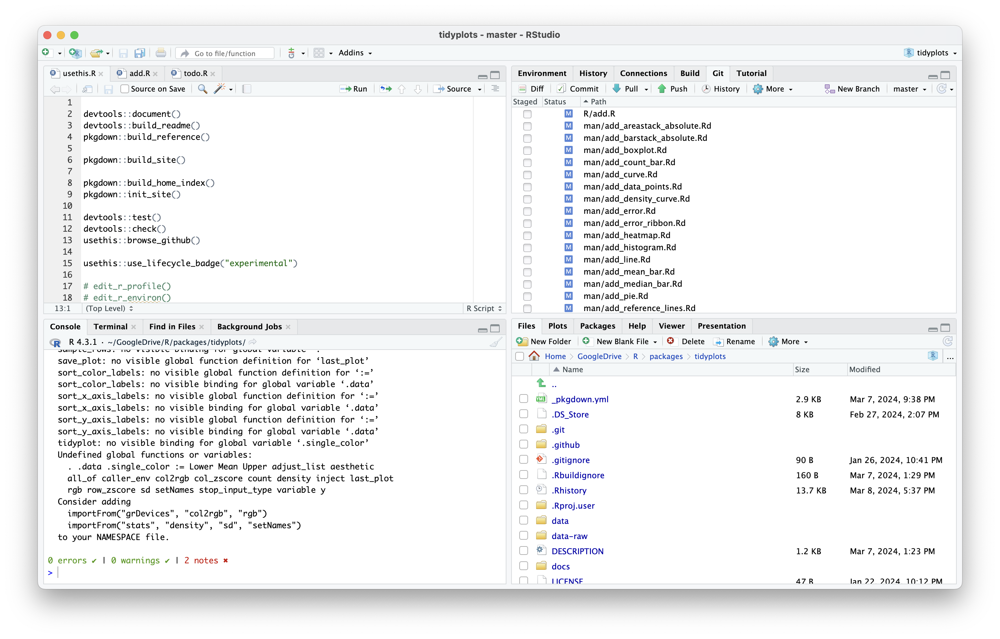

```{r, include = FALSE}
# knitr::opts_chunk$set(
#   collapse = TRUE,
#   comment = "#>"
# )
knitr::opts_chunk$set(
  collapse = TRUE,
  comment = "#>",
  results = FALSE,
  message = FALSE,
  warning = FALSE,
  fig.align = "center",
  fig.width = 5,
  fig.height = 2.5,
  dpi = 300
)

```

```{r setup}
library(tidyplots)
```



```{r}
# test function factories

study %>%
  tidyplot(treatment, score, color = treatment) %>%
  add_error_bar() %>%
  add_sd_bar() %>% 
  add_range_bar() %>% 
  add_ci95_bar() %>% 
  add_data_points()

study %>%
  tidyplot(score, treatment, color = treatment) %>%
  add_error_bar() %>%
  add_sd_bar() %>% 
  add_range_bar() %>% 
  add_ci95_bar() %>% 
  add_data_points()

study %>%
  tidyplot(treatment, score) %>%
  add_error_ribbon() %>%
  add_sd_ribbon() %>% 
  add_range_ribbon() %>% 
  add_ci95_ribbon() %>% 
  add_data_points()

study %>%
  tidyplot(score, treatment) %>%
  add_error_ribbon() %>%
  add_sd_ribbon() %>% 
  add_range_ribbon() %>% 
  add_ci95_ribbon() %>% 
  add_data_points()

study %>%
  tidyplot(treatment, score) %>%
  add_mean_bar(alpha = 0.3) %>% 
  add_mean_dash() %>% 
  add_mean_dot() %>% 
  add_mean_value() %>% 
  add_mean_line() %>% 
  add_mean_area(alpha = 0.2, fill = "green") %>% 
  add_data_points()

study %>%
  tidyplot(score, treatment) %>%
  add_mean_bar(alpha = 0.3) %>% 
  add_mean_dash() %>% 
  add_mean_dot() %>% 
  add_mean_value() %>% 
  add_mean_line() %>% 
  add_mean_area(alpha = 0.2, fill = "green") %>% 
  add_data_points()

study %>%
  tidyplot(treatment, score) %>%
  add_median_bar(alpha = 0.3) %>% 
  add_median_dash() %>% 
  add_median_dot() %>% 
  add_median_value() %>% 
  add_median_line() %>% 
  add_median_area(alpha = 0.2, fill = "green") %>% 
  add_data_points()

study %>%
  tidyplot(score, treatment) %>%
  add_median_bar(alpha = 0.3) %>% 
  add_median_dash() %>% 
  add_median_dot() %>% 
  add_median_value() %>% 
  add_median_line() %>% 
  add_median_area(alpha = 0.2, fill = "green") %>% 
  add_data_points()

study %>%
  tidyplot(treatment, score) %>%
  add_sum_bar(alpha = 0.3) %>% 
  add_sum_dash() %>% 
  add_sum_dot() %>% 
  add_sum_value() %>% 
  add_sum_line() %>% 
  add_sum_area(alpha = 0.2, fill = "green") %>% 
  add_data_points()

study %>%
  tidyplot(score, treatment) %>%
  add_sum_bar(alpha = 0.3) %>% 
  add_sum_dash() %>% 
  add_sum_dot() %>% 
  add_sum_value(extra_padding = 0.3) %>% 
  add_sum_line() %>% 
  add_sum_area(alpha = 0.2, fill = "green") %>% 
  add_data_points()

study %>%
  tidyplot(treatment) %>%
  add_count_bar(alpha = 0.3) %>% 
  add_count_dash() %>% 
  add_count_dot() %>% 
  add_count_value() %>% 
  add_count_line() %>% 
  add_count_area(alpha = 0.2, fill = "green")

# grouped

study %>%
  tidyplot(group, score, color = dose) %>%
  add_error_bar() %>%
  add_sd_bar() %>% 
  add_range_bar() %>% 
  add_ci95_bar() %>% 
  add_data_points()

study %>%
  tidyplot(group, score, color = dose) %>%
  add_error_ribbon() %>%
  add_sd_ribbon() %>% 
  add_range_ribbon() %>% 
  add_ci95_ribbon() %>% 
  add_data_points()

study %>%
  tidyplot(group, score, color = dose) %>%
  add_mean_bar(alpha = 0.3) %>% 
  add_mean_dash() %>% 
  add_mean_dot() %>% 
  add_mean_value() %>% 
  add_mean_line() %>% 
  add_mean_area(alpha = 0.5) %>% 
  add_data_points()

study %>%
  tidyplot(group, score, color = dose) %>%
  add_median_bar(alpha = 0.3) %>% 
  add_median_dash() %>% 
  add_median_dot() %>% 
  add_median_value() %>% 
  add_median_line() %>% 
  add_median_area(alpha = 0.5) %>% 
  add_data_points()

study %>%
  tidyplot(group, score, color = dose) %>%
  add_sum_bar(alpha = 0.3) %>% 
  add_sum_dash() %>% 
  add_sum_dot() %>% 
  add_sum_value() %>% 
  add_sum_line() %>% 
  add_sum_area(alpha = 0.5) %>% 
  add_data_points()

study %>%
  tidyplot(group, color = dose) %>%
  add_count_bar(alpha = 0.3) %>% 
  add_count_dash() %>% 
  add_count_dot() %>% 
  add_count_value() %>% 
  add_count_line() %>% 
  add_count_area(alpha = 0.5)


# add_data_points()

animals %>% 
  tidyplot(x = weight, y = size, color = number_of_legs) %>% 
  add_data_points()

animals %>% 
  tidyplot(x = weight, y = size, color = number_of_legs) %>% 
  add_data_points(confetti = TRUE)

## x is discrete

study %>% 
  tidyplot(x = treatment, y = score, color = treatment) %>% 
  add_data_points()
  
study %>% 
  tidyplot(x = treatment, y = score, color = treatment) %>% 
  add_data_points_jitter()

study %>% 
  tidyplot(x = treatment, y = score, color = treatment) %>% 
  add_data_points_beeswarm()

# confetti

study %>% 
  tidyplot(x = treatment, y = score, color = treatment) %>% 
  add_data_points(confetti = TRUE)
  
study %>% 
  tidyplot(x = treatment, y = score, color = treatment) %>% 
  add_data_points_jitter(confetti = TRUE)

study %>% 
  tidyplot(x = treatment, y = score, color = treatment) %>% 
  add_data_points_beeswarm(confetti = TRUE)

## highlighting

animals %>% 
  tidyplot(x = weight, y = size) %>% 
  add_data_points() %>% 
  add_data_points(data = max_rows(weight, n = 3), color = "red")

animals %>% 
  tidyplot(x = weight, y = size) %>% 
  add_data_points() %>% 
  add_data_points(data = max_rows(weight, n = 3), color = "red", shape = 1, size = 3)


animals %>%
  tidyplot(color = family) %>%
  add_barstack_absolute(alpha = 0.3)

animals %>%
  tidyplot(x = diet, color = family) %>%
  add_barstack_absolute(alpha = 0.3)

animals %>%
  tidyplot(y = diet, color = family) %>%
  add_barstack_absolute(alpha = 0.3)

animals %>%
  tidyplot(x = diet, y = speed, color = family) %>%
  add_barstack_absolute(alpha = 0.3)

animals %>%
  tidyplot(y = diet, x = speed, color = family) %>%
  add_barstack_absolute(alpha = 0.3)

#

animals %>%
  tidyplot(color = family) %>%
  add_barstack_relative(alpha = 0.3)

animals %>%
  tidyplot(x = diet, color = family) %>%
  add_barstack_relative(alpha = 0.3)

animals %>%
  tidyplot(y = diet, color = family) %>%
  add_barstack_relative(alpha = 0.3)

animals %>%
  tidyplot(x = diet, y = speed, color = family) %>%
  add_barstack_relative(alpha = 0.3)

animals %>%
  tidyplot(y = diet, x = speed, color = family) %>%
  add_barstack_relative(alpha = 0.3)

##

animals %>%
  tidyplot(x = diet, color = family) %>%
  add_areastack_absolute(alpha = 0.3) %>% 
  reverse_x_axis_labels()

animals %>%
  tidyplot(x = diet, y = speed, color = family) %>%
  add_areastack_absolute(alpha = 0.3)

# as_tidyplot

library(ggplot2)

p <- 
  study %>% 
  ggplot(aes(x = treatment, y = score, color = treatment, fill = treatment)) +
  stat_summary(fun = mean, geom = "bar", color = NA, width = 0.6, alpha = 0.3) +
  stat_summary(fun.data = mean_se, geom = "errorbar", linewidth = 0.25, width = 0.4) +
  geom_point(position = position_jitterdodge(jitter.width = 0.2))

p
p$mapping

as_tp <- 
  p %>%
  as_tidyplot() %>% 
  adjust_plot_area_padding(bottom = 0)
as_tp
as_tp$tidyplot

as_tp %>% 
  adjust_colors(new_colors = c("C" = "#766123")) %>% 
  reorder_x_axis_labels(c("C")) %>% 
  rename_x_axis_labels(c("C" = "control"))

```

